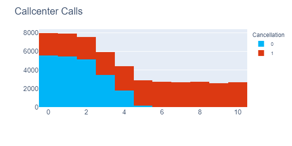

### Unsubscribe Insights

* Case: Customer cancellations

Recently, the company in question realized that more than 50% of their customers in their database are inactive, meaning they have canceled the service.

In order to improve its results, the company needs to understand the main reasons for these cancellations and determine which actions would be most efficient in retaining its customers.

* Customer profiles with the highest cancellation rates:

1) Customers who have a monthly contract

2) Customers who call the call center more than 4 times

3) Customers who have delayed payment for more than 20 days

* Strategic recommendations for minimizing churn and enhancing customer retention:

1) Offer discount on annual and quarterly plans
2) Create a process to resolve the customer's problem in a maximum of 3 calls
3) Create policy to resolve delays within 10 days

If the company implements these suggestions, the cancellation rate could decrease from 57% to 18%. 